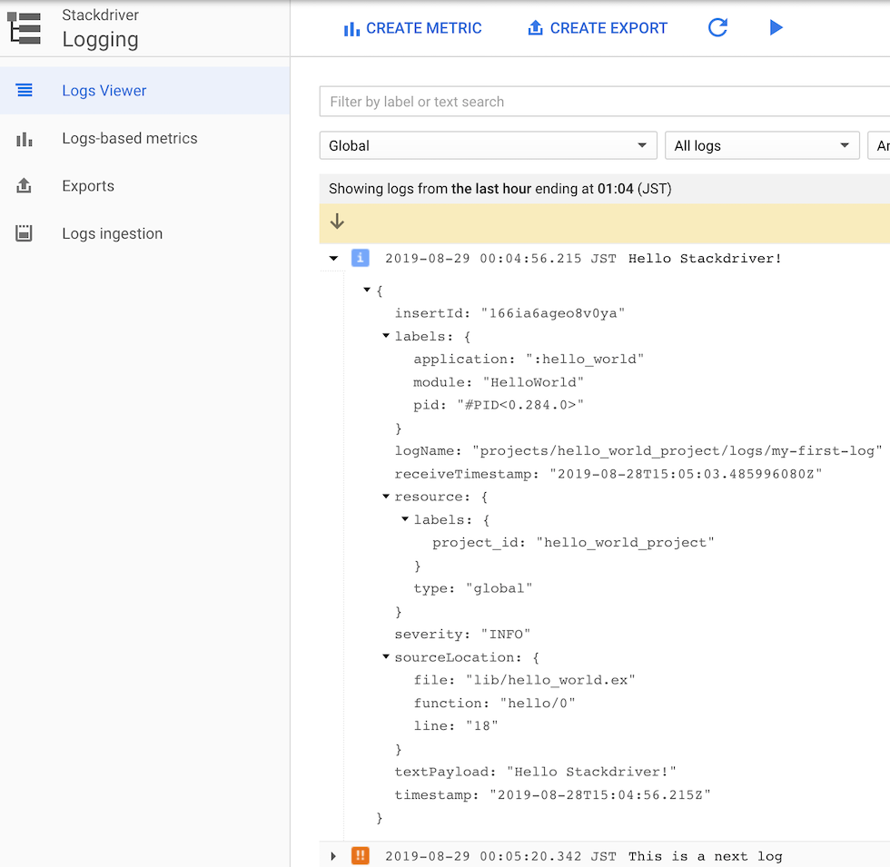

# LoggerStackdriverBackend

 A logger backend which sends logs to [Stackdriver](https://cloud.google.com/stackdriver/).



## Installation

```elixir
def deps do
  [
    {:logger_stackdriver_backend, github: "niku/logger_stackdriver_backend"}
  ]
end
```

## Configuration

```elixir
import Config

# First of all, add LoggerStackdriverBackend to the logger backends.
# And it needs to utc_log: true to work timestamp on Stackdriver correctly.
config :logger,
  backends: [:console, LoggerStackdriverBackend],
  utc_log: true

# Next, config for LoggerStackdriverBackend itself.
# Both project_id and log_name are required. It converts to "projects/#{project_id}/logs/#{log_name}" as logName on Stackdriver.
config :logger, :logger_stackdriver_backend,
  project_id: "hello_world_project",
  log_name: "my-first-log"

# Finally, It needs also config goth which is used by LoggerStackdriverBackend.
# You have to set up to read GCE credential json.
# You can use any setting in https://github.com/peburrows/goth#installation
config :goth,
  json: "path/to/google/json/creds.json" |> File.read!
```
